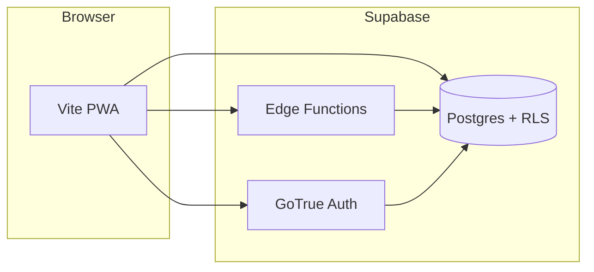

# Architecture — Daily Tens

## System context

## Repositories layout

| Path | Role |
|------|------|
| `web/` | Vite + TypeScript SPA; **dynamic import** of `@supabase/supabase-js`; Edge `fetch` for puzzle/submit; **manifest + icons**; **service worker** in production (`public/sw.js`). |
| `supabase/migrations/` | Schema, RLS, `get_leaderboard`, rate limit table. |
| `supabase/functions/` | Deno Edge Functions (public puzzle read, submit, admin). |
| `e2e/` | Playwright smoke + axe + optional auth integration spec. |

## Data flow (play path)

1. **Load puzzle** — `GET /functions/v1/get-daily-puzzle?play_date=YYYY-MM-DD` with `apikey` + `Authorization: Bearer <anon JWT>`.
2. **Grade (preview)** — Client compares answers to `puzzle_payload` for immediate UI feedback; score 0–100.
3. **Submit** — `POST /functions/v1/submit-result` with **`answers`** + user `access_token`; Edge loads `puzzle_payload`, **grades server-side**, inserts `game_results`; rate limit rows recorded before the puzzle read.
4. **Leaderboard** — `supabase.rpc('get_leaderboard', { p_play_date })` (anon allowed).

## Environment variables

### Web (Vite / Vercel)

| Variable | Required | Purpose |
|----------|----------|---------|
| `VITE_SUPABASE_URL` | Yes | Project URL. |
| `VITE_SUPABASE_ANON_KEY` | Yes | Public anon key. |
| `VITE_SITE_URL` | No | If set, overrides auto URL. On **Vercel** builds without it, Vite uses `VERCEL_PROJECT_PRODUCTION_URL` (production) or `VERCEL_URL` (preview) for canonical + `og:url`. |

### Edge Functions (Supabase Dashboard → Secrets)

| Variable | Required | Purpose |
|----------|----------|---------|
| `SUPABASE_URL` | Yes (auto) | API URL. |
| `SUPABASE_ANON_KEY` | Yes (auto) | Verify JWTs. |
| `SUPABASE_SERVICE_ROLE_KEY` | Yes (auto) | DB writes, rate limit. |
| `ALLOWED_ORIGINS` | No | Comma-separated origins; empty = `*` (dev). |
| `SUBMIT_RATE_LIMIT_USER_PER_MIN` | No | Default `30`. |
| `SUBMIT_RATE_LIMIT_IP_PER_MIN` | No | Default `60`. |

## Security notes

- Service role never ships to the browser.
- `rate_limit_events` has RLS enabled with **no** policies → PostgREST denies; Edge uses service role.
- Production should set `ALLOWED_ORIGINS` to your Vercel + custom domains.

## Related documentation

- **[`API.md`](API.md)** — request/response narrative for Edge Functions.  
- **[`openapi.yaml`](openapi.yaml)** — OpenAPI 3.1 for the same contracts.  
- **[`SECURITY.md`](SECURITY.md)** — CORS allowlist, submit rate limits, manual verification notes.
