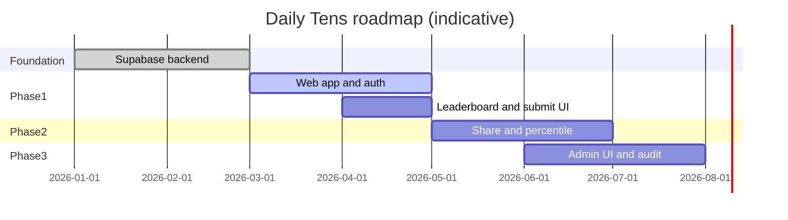

# Daily Tens — Product Requirements Document (PRD)

**Document version:** 1.0  
**Last updated:** 2026-03-31  
**Status:** Active — aligned with in-repo Supabase backend  

---

## 1. Executive summary

**Daily Tens** is a daily trivia-style game: one canonical puzzle per calendar day, quick play sessions, social sharing, and competitive ranking. This PRD defines product intent, user-facing requirements, and a phased roadmap. The **technical source of truth** for what is already built lives in the repository (`supabase/migrations`, `supabase/functions`, `README.md`, `supabase/ADMIN_WORKFLOW.md`).

**Strategic shift:** Move from a legacy Azure REST API toward **Supabase** (Postgres, Auth, RLS, Edge Functions) for faster iteration, clearer security boundaries, and a unified data model—while preserving room to match legacy client contracts if a compatibility layer is required later.

---

## 2. Vision and product thesis

### 2.1 Vision

Become the default “one quick brain-teaser a day” habit for players who enjoy trivia and word-style challenges, with fair competition and frictionless sharing.

### 2.2 Thesis

- **Habit:** A single **daily** moment (same puzzle for everyone that day in a timezone/UTC policy you define).
- **Accessibility:** Playable on mobile web first; optional installable PWA later.
- **Fair play:** Published content only; scores tied to authenticated identity; **unlimited retries** with **leaderboard = best score per user per day** (current backend behavior).
- **Growth:** Share and invite loops without compromising user privacy.

---

## 3. Goals and non-goals

### 3.1 Goals (product)

| ID | Goal | Measure (examples) |
|----|------|----------------------|
| G1 | Daily active play | DAU, completions per day |
| G2 | Return visits | D1/D7 retention, streaks in product |
| G3 | Social distribution | Share taps, referral-attributed signups |
| G4 | Trust and fairness | Abuse reports down, clear rules, stable rankings |
| G5 | Operable content pipeline | Time to publish a day’s puzzle; error rate on publish |

### 3.2 Non-goals (for now)

- Real-money gambling or prizes with legal/compliance overhead.
- User-generated puzzle authoring at scale without moderation.
- Native-only apps as the **primary** delivery channel (web remains primary through Phase 2).

---

## 4. Personas

| Persona | Needs | Product implications |
|---------|--------|----------------------|
| **Casual player** | Quick play, clear rules, works on phone | Simple UX, fast load, offline-friendly shell later |
| **Competitive player** | Fair ranks, retries, see percentile / friends | Leaderboard clarity, optional richer stats |
| **Sharer / advocate** | One-tap share, good preview cards | OG/meta, share endpoints, referral attribution |
| **Content editor** | Safe draft → publish, preview as player | Admin UI or Studio workflow, audit trail later |
| **Operator / admin** | RLS, no accidental data leaks, observability | Supabase policies, function logs, alerts |

---

## 5. Scope overview

### 5.1 MVP (player)

- Land on marketing/home; start **today’s** (or selected) published puzzle.
- Complete a run; see outcome (score, optional percentile copy later).
- **Sign in** (email/OAuth per Supabase config) to submit scores.
- View **leaderboard** for a date (best score per user for that puzzle day).
- **Unlimited** plays per puzzle; each attempt stored; rank uses **best** attempt.

### 5.2 MVP (admin)

- Create/edit puzzle content keyed by **`play_date`** (`puzzle_payload` JSON + metadata).
- Transition **`draft` → `published`** (and reverse if needed).
- Promote trusted accounts to **`profiles.role = 'admin'`** (manual SQL or future tooling).

### 5.3 Already implemented (backend — repo)

- Tables: `profiles`, `puzzles`, `game_results`.
- RLS: published puzzles readable by anon/authenticated (date rules); profiles self-service; game results insert/select own.
- RPC: `get_leaderboard(p_play_date)` (public-safe columns).
- Edge Functions: `get-daily-puzzle`, `submit-result`, `admin-upsert-puzzle`, `admin-publish`.
- CI: minimal GitHub workflow; seed SQL for dev.

---

## 6. Functional requirements

Requirements use **MoSCoW** priority. IDs are stable for roadmap traceability.

### 6.1 Authentication and identity

| ID | Requirement | Priority |
|----|-------------|----------|
| A1 | Players can sign up and sign in via Supabase Auth (email + at least one OAuth provider TBD). | Must |
| A2 | Profile row auto-created on signup (`display_name`, `avatar_url` from metadata when present). | Must |
| A3 | Session refresh and sign-out do not corrupt in-progress local game state (client responsibility; document contract). | Should |
| A4 | Optional: link legacy anonymous `userId` to Supabase user (migration path). | Could |

### 6.2 Daily puzzle and game loop

| ID | Requirement | Priority |
|----|-------------|----------|
| P1 | Exactly one **canonical** puzzle per **`play_date`** (UTC date in DB; client display timezone policy documented). | Must |
| P2 | Fetch published puzzle for a date; reject future dates for public play. | Must |
| P3 | Puzzle structure stored in **`puzzle_payload` JSONB**; client interprets schema version in payload or `puzzles.version`. | Must |
| P4 | Unlimited attempts per user per puzzle; each completion may **submit** a result. | Must |
| P5 | Optional: server-side validation hooks (e.g. max score, required fields) in `submit-result`. | Should |
| P6 | Optional: anti-cheat signals (`client_meta`, timing heuristics)—no false-positive mass bans without review. | Could |

### 6.3 Scoring and leaderboard

| ID | Requirement | Priority |
|----|-------------|----------|
| L1 | Leaderboard for date **D** ranks users by **best score** among attempts on puzzle(s) for **D**; tie-breaker: lower **`time_ms`** (when present). | Must |
| L2 | Leaderboard response exposes only **display_name**, **score**, **time_ms**, **rank** (no raw email/UUID to anon). | Must |
| L3 | Authenticated user can list **own** `game_results` (history / personal stats). | Should |
| L4 | “Percentile” or global distribution view (legacy product had percentile UX). | Should |
| L5 | Friends-only or private groups leaderboard. | Could |

### 6.4 Social and growth

| ID | Requirement | Priority |
|----|-------------|----------|
| S1 | Share flow after completion (native share + clipboard fallback). | Should |
| S2 | Referral parameter on signup URL; store referrer on profile or separate table. | Could |
| S3 | Suggestion / feedback capture (legacy had suggest endpoint). | Could |
| S4 | Marketing pages: SEO basics for landing; link to play. | Should |

### 6.5 Admin and content

| ID | Requirement | Priority |
|----|-------------|----------|
| C1 | CRUD puzzle by `play_date` via secured admin path (Edge Functions + `role = admin`). | Must |
| C2 | Publish / unpublish without exposing drafts to public API. | Must |
| C3 | Preview puzzle as player before publish (admin-only or impersonation). | Should |
| C4 | Audit log: who published, when (table or external log). | Should |
| C5 | Bulk import (CSV/JSON) for puzzle bank. | Could |

### 6.6 Platform, legal, and trust

| ID | Requirement | Priority |
|----|-------------|----------|
| T1 | Privacy policy and terms linked from app; age stance documented. | Must (before broad marketing) |
| T2 | Rate limiting on `submit-result` and auth-sensitive endpoints. | Should |
| T3 | Abuse reporting contact or in-app form. | Could |
| T4 | GDPR/CCPA export/delete path (Supabase Auth + app data). | Should (EU/CA users) |

---

## 7. Non-functional requirements (NFRs)

| Area | Target |
|------|--------|
| **Availability** | Align with Supabase tier; define maintenance windows for content. |
| **Latency** | P95 puzzle fetch &lt; 500 ms; submit &lt; 1 s under normal load (excluding client render). |
| **Security** | No service role in browser; RLS on user tables; generic 500 bodies in Edge Functions; CORS reviewed for production origins. |
| **Accessibility** | WCAG 2.1 AA targets for core play path (labels, contrast, keyboard). |
| **Observability** | Structured logs on functions; error alerting; optional product analytics (privacy-preserving). |
| **i18n** | English first; copy externalized for later locales. |

---

## 8. Data model summary (current backend)

| Entity | Purpose |
|--------|---------|
| **`profiles`** | App profile + `role` (`user` / `admin`). |
| **`puzzles`** | One row per `play_date`; `status`, `puzzle_payload`, `version`, optional `title` / `checksum`. |
| **`game_results`** | One row per **attempt**; `user_id`, `puzzle_id`, `score`, `time_ms`, `client_meta`. |
| **`get_leaderboard(date)`** | Best score per user for that puzzle date. |
| **`leaderboard_daily` view** | Internal/reporting; not granted to anon API (revoked from public). |

---

## 9. API and integration surface (current)

| Surface | Use |
|---------|-----|
| PostgREST + RLS | Direct reads where policies allow (e.g. published `puzzles`). |
| `get_leaderboard` RPC | Public leaderboard from anon/authenticated client. |
| `get-daily-puzzle` | Edge Function; service-role-backed consistent JSON. |
| `submit-result` | Edge Function; JWT required; inserts `game_results`. |
| `admin-*` | Edge Functions; JWT + `profiles.role = admin`. |

**Legacy note:** Production [dailytens.com](https://dailytens.com) historically used a single Azure REST host. A future **compatibility gateway** could map those paths to this backend if drop-in replacement is required.

---

## 10. Dependencies and open decisions

| Topic | Decision needed |
|-------|-----------------|
| **Timezone** | Is “daily” boundary UTC everywhere, or user-local with explicit cutover? |
| **`puzzle_payload` schema** | Lock JSON schema per `version`; validate in admin function and optionally in client. |
| **Percentile** | Compute from `game_results` distribution vs cached aggregates. |
| **Rate limits** | Per-IP vs per-user limits on submit; values TBD. |
| **OAuth providers** | Which IdPs (Google, Apple, etc.) for launch. |

---

## 11. Success metrics (KPIs)

| KPI | Definition | Phase |
|-----|------------|-------|
| DAU | Unique users with ≥1 puzzle load/day | 1 |
| Completion rate | Submissions / puzzle loads | 1 |
| D1 retention | Return next calendar day | 2 |
| Share rate | Shares / completions | 2 |
| p95 API latency | Edge + DB | Ongoing |
| Incident count | Sev1/Sev2 per month | Ongoing |

---

## 12. Feature roadmap

Roadmap is **theme-based**. Timelines are indicative; adjust per team size.

### Phase 0 — Foundation (**Done / in repo**)

- Supabase schema, RLS, grants, seed.
- Edge Functions: puzzle read, submit, admin upsert/publish.
- Unlimited plays + best-score leaderboard logic.
- Minimal CI, env example, admin workflow doc.

### Phase 1 — Shippable player experience (**Next**)

| Feature | Description | PRD refs |
|---------|-------------|----------|
| **Web app shell** | Vite/React or Next.js: home, play route, auth screens. | P1–P4, A1–A2 |
| **Puzzle contract** | Typed `puzzle_payload` v1 + rendering in UI. | P3 |
| **Submit integration** | Wire `submit-result` + error states. | P4–P5 |
| **Leaderboard UI** | `get_leaderboard` + loading/empty states. | L1–L2 |
| **Production hardening** | CORS allowlist, rate limits, monitoring. | T2, NFRs |
| **Legal baseline** | Privacy + terms pages. | T1 |

### Phase 2 — Growth and depth

| Feature | Description | PRD refs |
|---------|-------------|----------|
| **Percentile / stats** | Post-game stats; optional RPC. | L4 |
| **Share + OG** | Social cards, deep links. | S1 |
| **Referrals** | URL param → persist referrer. | S2 |
| **Personal history** | Own attempts list / best streaks client-side or API. | L3 |
| **PWA** | Install, offline shell, cache static assets. | NFRs |
| **SEO** | Landing content, structured data. | S4 |

### Phase 3 — Admin and operations

| Feature | Description | PRD refs |
|---------|-------------|----------|
| **Admin UI** | CRUD/publish without raw SQL. | C1–C3 |
| **Audit trail** | Publish events. | C4 |
| **Bulk import** | Content pipelines. | C5 |
| **Moderation** | Suggestions queue if UGC opens. | S3 |

### Phase 4 — Scale and differentiation

| Feature | Description | PRD refs |
|---------|-------------|----------|
| **Friends / groups** | Scoped leaderboards. | L5 |
| **Achievements** | Badges, streaks server-side. | New epic |
| **Experiments** | Feature flags on puzzle fetch. | P6 |
| **i18n** | Second locale. | NFRs |

---

## 13. Roadmap visualization (Mermaid)

---

## 14. Verification checklist (release gates)

- [ ] Migrations apply on clean project; seed runs.
- [ ] Anonymous cannot read draft/future puzzles; cannot read others’ `game_results`.
- [ ] Authenticated submit creates rows; leaderboard shows one line per user with best score.
- [ ] Non-admin cannot call admin functions; admin can publish.
- [ ] No service role in client bundle; production CORS not `*` if policy requires.
- [ ] Privacy policy and terms linked before marketing spend.

---

## 15. Glossary

| Term | Meaning |
|------|---------|
| **play_date** | Calendar date of the puzzle (stored as `date`; UTC in DB unless product defines otherwise). |
| **puzzle_payload** | JSON document with clues, answers, layout—versioned via `puzzles.version` or in-payload field. |
| **Best score** | For leaderboard, max `score` per user for that `play_date`; tie-break `time_ms` ascending. |

---

## 16. Document maintenance

- Update **§5.3** and **§8–9** when migrations or functions change.
- Update **§12** when priorities shift; keep PRD refs in sync with issue tracker labels (`PRD-P1`, etc.) if used.

---

*End of PRD.*
